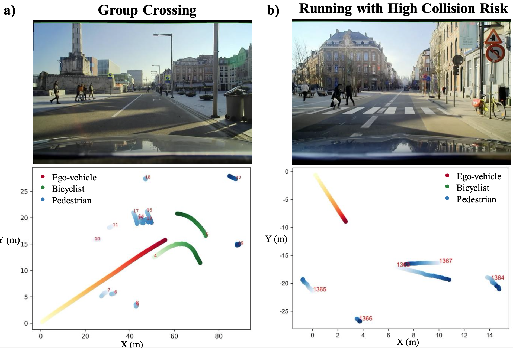
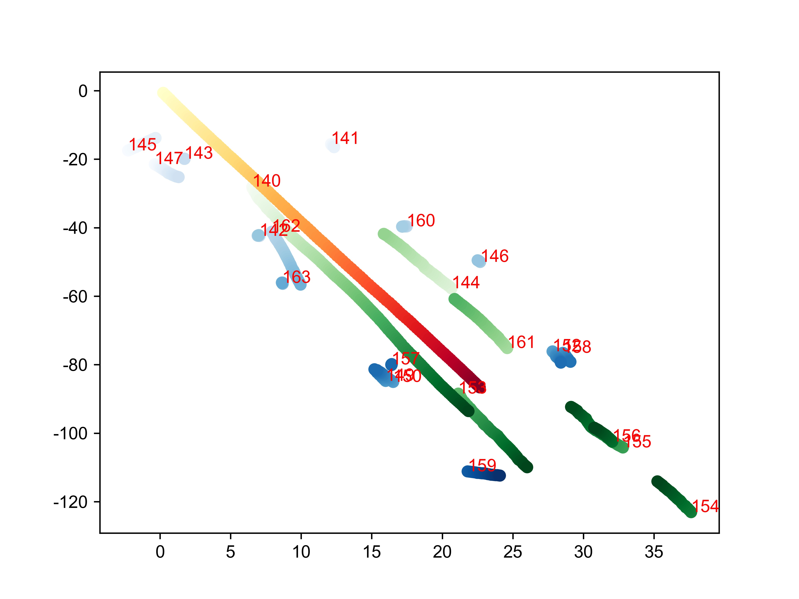
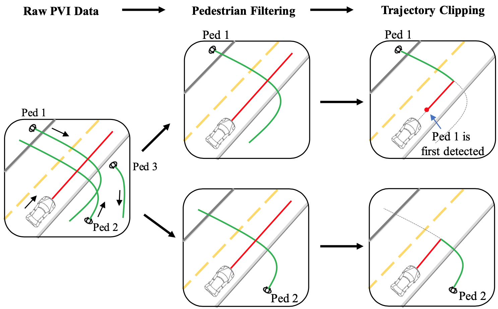
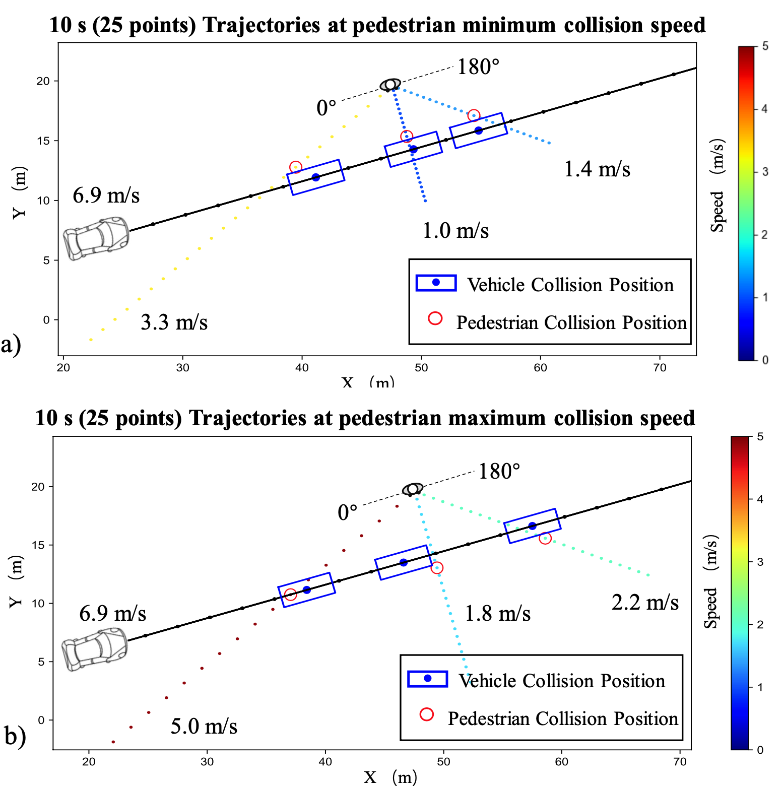
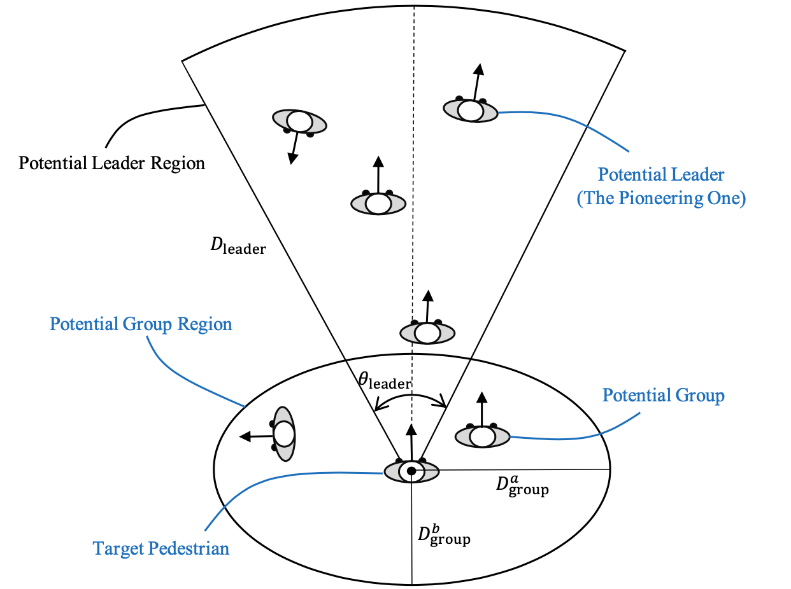

# Risk Image of Pedestrian-Vehicle Interaction

This project furnishes a dataset comprising:

（1）risk images of street-crossing pedestrians and 

（2）their crossing action labels, derived using a comprehensive multi-path risk assessment methodology.

（3）Python code for the algorithm responsible for creating risk images from trajectory data is also available.


## Raw Data:

The raw data originates from the Euro-PVI dataset. 

The Euro-PVI comprises 6,177 pedestrians captured across 1,077 dense urban scenes in Brussels and Leuven, Belgium. Trajectory points for pedestrians, cyclists, and the ego-vehicle are recorded in the absolute coordinate system, along with corresponding vehicle perspective images. The data is sampled at a frequency of 10 Hz. Most of the scenes were collected at unsignalized intersections or mid-block sections. It also provides a considerable number of unique scenarios, including group crossings, pedestrian running, and evasive maneuvers with high collision risk.



We will not provide the raw data. Only processed data with a different data structure is available.

**See the trajectory plot of each scene in the `traj_pic` directory.** For example:




### Pre-processing procedures

Due to the lack of intention and action labels, pre-processing procedures including pedestrian filtering, trajectory clipping, and ground truth annotating are processed. 



#### Pedestrian Filtering

Pedestrian filtering aims to find those pedestrians who have the crossing intent. 

We designed pedestrian filtering experiments to exclude pedestrians who had not been involved in pedestrian-vehicle interactions (PVIs). Fifteen participants are invited for the experiment, differing mainly in their driving experience: non-driver passengers, novice drivers (driving experience less than 5 years), or experienced drivers. 

The experiment involved watching short videos from the Euro-PVI dataset. Each participant is asked to assume the role of a driver while viewing the videos. Participants will first watch the entire driving video from the vehicle's perspective. Then, during the second playback, they are asked to identify pedestrians they believe they would pay attention to while driving or pedestrians that would significantly affect their driving behavior. 

We also implemented an additional screening process based on trajectory characteristics to ensure that pedestrians with significant lateral crossing movements were not overlooked. This process includes retaining pedestrians who have already stepped onto the roadway and those outside the curb but moving towards the lane. The minimum speed threshold for these pedestrians is set at 0.3m/s, indicating a forward movement of at least one step per second.

#### **Trajectory Clipping**

In each scene, the interactions between ego-vehicle and filtered pedestrians do not occur simultaneously. Consequently, each pedestrian trajectory is paired with the corresponding ego-vehicle trajectory to establish a unique data structure. Trajectory Clipping is then conducted based on the initial and end points of interaction.

The initial point is designated as the instance at which the pedestrian is first detected. The trajectory's endpoint is defined as the point at which either the pedestrian has crossed the central axis of the street or the vehicle has crossed the central axis of the pedestrian.

#### Data Statistic

All the selected pedestrians are recorded in 

**We selected 494 pedestrians from Euro-PVI dataset.**

Due to the lack of raw data ownership, our provision is limited to pedestrian global identifiers from the Euro-PVI dataset, complemented by insights garnered through both data analysis and manual research. 

This encompasses:

1.Determinations of whether pedestrians cross ahead of the ego-vehicle,

2.Their crossing directions

3.Identifiers for leaders, group members, and pedestrians from opposing directions.


**See the trajectory plot of each pedestrian-vehicle interaction in the `traj_pic_after_process` directory**. For example:


**See the videoes from ego-vehicle perspective of each pedestrian-vehicle interaction in the `selected_PVI_videoes` directory.** 

## Risk Image

**The imaging algorithm is provided in `algorithm`**

**Run `action_annatation_and_risk_image.py`, risk images will be generated in `algorithm/risk_image`**

**Action labels are also determined.**

All pedestrian feasible crossing paths are described by motions (i.e., velocities and headings), then visualized by a semicircular region representing one pedestrian’s feasible crossing motion domain (FCMD). A multi-motion collision checking approach is proposed to estimate the collision outcomes of the interaction between pedestrians and the ego-vehicle under varying crossing motions. Three collision outcomes are indicated by varying colors in the FCMD. Besides, surrounding pedestrians affecting the target pedestrian are captured through a region of interest filtering method as their motions may let the target pedestrian disregard the risks. Finally, a set of pixelation rules is designed for generating risk images to (i) balance information density with image resolution, (ii) embed influential pedestrian motions, and (iii) establish the hierarchy of information importance.

### Feasible Crossing Motion Domain (FCMD)

We establish a relative polar coordinate system in the velocity domain as FCMD to represent the potential motion range of a pedestrian.


Let us define a specified pedestrian motion $M_{ped}=[v_{ped},h_{ped}]$, where $v_{ped}$ denotes the speed and $h_{ped}$ denotes the heading. The range of $h_{ped}$ is set to be 0-180 degrees to focus on the motions associated with crossing maneuvers.  The $h_{ped}$ is a relative concept determined by the heading of the ego-vehicle to ensure consistency in risk assessment across different scenarios.

We define that when they have the same heading angle, $h_{ped}$ equals 180 degrees. This ensures the ego-vehicle always travels with a heading of 180 degrees. The setting of the maximum speed takes into account scenarios where pedestrians may run. In the dataset used in this study, the highest recorded running speed integrated in a 0.5s interval is around 5m/s. Therefore, we set the range of $v_{ped}$ to be 0-5 m/s.

### Multi-path Collision Checking

Ten-second trajectories with 25 points of vehicles and pedestrians were calculated respectively through the constant acceleration (CA) model and constant velocity (CV) model. The occupied space of the ego-vehicle is a rectangle with a length of 4.8m, and a width of 2m. Pedestrians are depicted as a circle with a radius of 0.5m. Here is a typical instance.



### Determination of Influential Pedestrians

We find out the pedestrians that may influence the decision-making of the subject pedestrian.  We mainly categorized them into two parts: the potential group and the potential leader.

The potential group refers to the pedestrians around the subject pedestrian whose headings are similar. 

A potential leader is an individual who is inside a certain region of interest and in a moving direction close to that of the subject pedestrian. 



We define $D_{\text{leader}}$ as 3 meters,  $\theta_{\text{leader}}= 20,\Delta\theta=10$.

### Risk Imaging


See all the risk images in `risk_images`

## Crossing Action Ground Truth Annotation

We classify action labels into three categories: 

1. **yielding,** 
2. **risky crossing,** 
3. **safe crossing.** 

See crossing_action_annotation_demo_video in `crossing_action_annotation_demo_video/Annotation.mp4`

See trajectory data with action labels in `data_with_action_labels`


Data structure:

One eample:

```python
one_ped_info = {
        'ped_id': '1',
        'seg_num': [0, 1, 2, 3, 4], # 0.5s time interval number
        'cross': True,  # pedestrian crossing before vehicle's arrvial
  			'status':[0,0,1,1,2], # 0:yield, 1: risky crossing, 2:safety crossing 
        'ped_crossing_dir': 'left',  # or right
        'seg_car_loc': [[-81.54927944655948, 6.429980591089609], [-82.31095461250264, 6.54679649674744],[-83.05742509035734, 6.665760834569962], [-83.79004325016825, 6.7848213101814405],[-84.5055393896481, 6.905313711685152], [-85.20370989723078, 7.027244145888625],],
        'seg_ped_loc': [[-118.07308000464937, 9.152431511633333], [-118.02624195834309, 9.270064183087667],[-117.98254823995275,9.386253133805052], [-117.96545996722396, 9.533519183036312],[-117.9367517692744, 9.6578454969176], [-117.90721372574974, 9.787760512366372]],
        'seg_car_avg_v': [7.40508019915635, 7.255131200030104, 7.117755402468026, 6.987626386500061, 6.874974508718057, 6.767980599500102],
        'seg_car_avg_vx': [-7.308000000000002, -7.153999999999999, -7.014, -6.882000000000001,-6.767999999999999, -6.659999999999999],
        'seg_car_avg_vy': [1.194, 1.206, 1.21, 1.2099999999999997, 1.2079999999999997, 1.2040000000000002],
        'seg_ped_avg_v': [1.319645201603826, 1.3402480097937017, 1.370234095178267, 1.35630300586297,1.3875550855147316, 1.4086245655944396],
        'seg_ped_avg_vx': [0.33399999999999996, 0.3, 0.27, 0.294, 0.294, 0.292],
        'seg_ped_avg_vy': [1.27, 1.302, 1.342, 1.324, 1.3559999999999999, 1.3780000000000001],
        'seg_car_avg_a': [-1.4979999999999998, -1.3719999999999999, -1.3, -1.126, -1.07, -1.0859999999999999],
        'seg_car_avg_ax': [1.54, 1.4, 1.32, 1.1400000000000001, 1.08, 1.1],
        'seg_car_avg_ay': [0.12, 0.04, 0.0, -0.019999999999999997, -0.04000000000000001, -0.020000000000000007],
        'seg_ped_avg_a': [0.20600000000000004, 0.3, -0.13799999999999998, 0.31399999999999995,0.21200000000000002, 0.17400000000000002],
        'seg_ped_avg_ax': [-0.33999999999999997, -0.30000000000000004, 0.24, 0.0, -0.02, -0.02],
        'seg_ped_avg_ay': [0.32, 0.4000000000000001, -0.18, 0.31999999999999995, 0.22000000000000003, 0.18000000000000002],
        'seg_car_avg_h': [4.8740000000000006, 4.880000000000001, 4.884, 4.888, 4.89, 4.892],
        'seg_ped_avg_h': [0.262, 0.22999999999999998, 0.19999999999999998, 0.21800000000000003, 0.21400000000000002,0.21000000000000002],
        'seg_group_avg_v': [2, 2, 2.2, 2, 2.2, 2.1],
        'seg_group_avg_h': [0, 0, 0, 0, 0],
        'seg_leader_avg_v': [3, 3, 3.2, 3, 3.2, 3.1],
        'seg_leader_avg_h': [0, 0, 0, 0, 0],
    }

  """

  curr_action_list_all_seg = [
  [0,0,0,0,1,1,1,1,2,2,2,2...],[],[],...
  ]

  boundray_list_all_seg = [
  {
  '0':[v1,v2],'1':[,],...,'30':[,]
  },
  ...
  ]

  """
```

